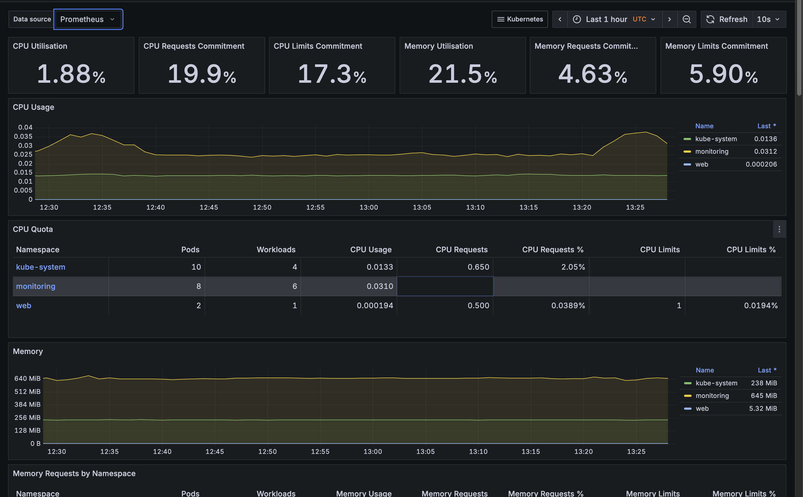

# Simple Web Application

## Overview
This repository contains a simple web application built with **HTML, CSS, and JavaScript**.  
It was created as part of a Technical Devops Assessment.

## Task 1: Version Control Integration

### Objective:
Set up a Git repository for a simple web application, make meaningful commits, and push the repository to a remote Git server.

### Approach:

- Created a public repository on GitHub and cloned it locally.

- Added a simple web app consisting of:

    - index.html (main entry point)

    - style.css (basic styling)

    - app.js (JavaScript functionality)

- Staged and committed the changes with clear, descriptive commit messages,Opened Pull requests against the main branch and merged code.


## Task 2: Containerization with Docker

This task involves containerizing the sample web application using **Docker**.  
The container runs an **Nginx server** to serve the static web files.

---

## How to Build & Run the Container

### 1. Navigate to the Project Root
Go to the folder where the `Dockerfile` is located.  

### 2 . Build the Docker Image
Run the following command to build the Docker image:

```bash
docker build -t sample-web-app .
```

### Run the Container

Run the container and map port 8080 on your host to port 80 inside the container:

```bash
docker run -d -p 8080:80 sample-web-app
```
### Access the Application

Once the container is running, open your browser and navigate to:

```bash
http://localhost:8080
```
You should see the sample web application being served by Nginx.

## Bonus Sub-task: Docker Compose (Multi-Container)

In addition to containerizing the simple web app, a **Docker Compose setup** is included to simulate a multi-container environment consisting of:

- **Web App** (served via Nginx)  
- **Postgres Database** (for local development/testing)  

The `docker-compose.yml` file is available in the **`simple-web-app`** folder.

---

### Run with Docker Compose

From the `simple-web-app` folder, run:

```bash
docker-compose up --build
```

## Task 3: Infrastructure as Code (IaC) (DevOps and Cloud Engineering)
### Objective:
Use an IaC tool of your choice(Terraform, Pulumi, CloudFormation, Bicep or OpenTofu) to define and deploy resources.
### Approach:
I chose Terraform because it is cloud-agnostic, making the infrastructure definitions portable and reusable across different cloud providers.
I deployed resources on AWS cloud, including networking, compute, and Kubernetes infrastructure. This setup lays the foundation for deploying the containerized application in Task 4 on Amazon EKS with load balancing.

#### 1.Networking (VPC & Subnets)

- Created a VPC with both public and private subnets across multiple Availability Zones.

- Attached an Internet Gateway and configured route tables for public subnet internet access.

- Created private subnets for the EKS worker nodes to improve security.

#### 2.Security Groups

- Created a security group for the EC2 instance with: Ports 22 open for SSH and 80(http) for web traffic.

- Created security groups for the EKS cluster and nodes, allowing secure communication between control plane, worker nodes, and load balancers.

#### 3.EC2 Instance with Static IP

- Provisioned an EC2 instance

- Used Terraform tls_private_key and aws_key_pair to automatically generate and manage SSH keys.

- Associated an Elastic IP (EIP) to ensure the instance has a static public IP.

#### 4.EKS Cluster Setup

- provisioned an EKS cluster with worker node groups inside private subnets.

- Integrated with IAM roles for cluster and node authentication.

#### 5.AWS Load Balancer Controller

- Deployed the AWS Load Balancer Controller into the EKS cluster via Terraform Helm provider.

- This enables the cluster to provision Application Load Balancers (ALB) and Network Load Balancers (NLB) for Kubernetes Ingress resources.

- Configured IAM policies via Terraform to grant the controller permissions for managing AWS load balancers.


## Task 4: CI/CD Pipeline with Cloud Integration (DevOps and Cloud Engineering)
### Objective:
The goal of this task is to design and implement a Continuous Integration and Continuous Deployment (CI/CD) pipeline using GitHub Actions that:

- Builds and tags a Docker container image for the web application.

- Packages and pushes the image to a cloud container registry (AWS Elastic Container Registry – ECR).

- Deploys the application automatically to a cloud-based Kubernetes environment hosted on Amazon EKS (Elastic Kubernetes Service).

### Prerequisites
Before setting up and running the CI/CD workflow, ensure the following configurations are completed:

1. Configure GitHub Actions OIDC with AWS

- This enables secure, keyless authentication between GitHub Actions and AWS using OpenID Connect (OIDC).

- It allows GitHub to assume an IAM role in AWS without storing long-term access keys.

Follow this detailed guide to configure OIDC:
🔗 https://devopscube.com/github-actions-oidc-aws/

2. Create an AWS Elastic Container Registry (ECR)

- The ECR repository must exist before running the workflow, as it is not provisioned by the infrastructure Terraform modules.

Example command to create one:
```bash
aws ecr create-repository \
  --repository-name savannah-web \
  --image-scanning-configuration scanOnPush=true \
  --region <your-region>

```
- Ensure the repository name matches the value stored in the GitHub secret ECR_REPOSITORY

### Pipeline Overview
The pipeline, defined in .github/workflows/deploy.yaml, automates the entire build → package → deploy process.

#### Workflow Steps:

1. Trigger

- The workflow runs automatically whenever a new commit is pushed to the main branch.

2. Environment Setup

- Configures AWS credentials and region using GitHub secrets.

- Authenticates Docker with AWS ECR.

3. Build and Tag Container Image

- Builds the application Docker image from the Dockerfile in the repository root.

- Tags the image using either:

   - The version specified in the VERSION file (if available), or

   - The short Git commit SHA (as a fallback).

4. Push Image to AWS ECR

- Pushes the tagged image to the configured ECR repository.

- Ensures that all image tags are unique for traceability and rollback capability.

5. Deploy to Amazon EKS

- Connects to the EKS cluster using the aws eks update-kubeconfig command.

- Applies Kubernetes manifests (deployment.yaml, service.yaml, and ingress.yaml) from the kubernetes-manifests directory.

- Updates the running deployment with the newly built image tag.

### Key Features and Implementation Details

1. Pipeline Tool

Tool Used: GitHub Actions

Reason: Seamless integration with GitHub, easy secret management, native support for AWS authentication, and scalable execution runners.

2. Environment Variables and Secrets

All sensitive variables are securely stored as GitHub Secrets:

## Deployment Verification
After the CI/CD workflow runs successfully, the application is automatically deployed to the AWS EKS cluster.
Below are verification screenshots showing that the Kubernetes resources are running as expected.

### 1.Pods Running
```
kubectl get pods -n web
```

Example output:

```
musyokakilonzo@CP-Mac-Musyoka savannah-devops-assessment % kubectl get pods -n web
NAME                            READY   STATUS    RESTARTS   AGE
savannah-web-69bccdf795-gqcsz   1/1     Running   0          73m
savannah-web-69bccdf795-xvphq   1/1     Running   0          73m

```

### 2. Services Exposed
```
musyokakilonzo@CP-Mac-Musyoka savannah-devops-assessment % kubectl get svc -n web
NAME               TYPE        CLUSTER-IP      EXTERNAL-IP   PORT(S)   AGE
savannah-web-svc   ClusterIP   172.20.84.181   <none>        80/TCP    120m
musyokakilonzo@CP-Mac-Musyoka savannah-devops-assessment % kubectl get ingress -n web
NAME                   CLASS   HOSTS                                  ADDRESS                                                             PORTS   AGE
savannah-web-ingress   alb     web.193801312183.realhandsonlabs.net   k8s-devopstools-fe606a875d-1462431353.us-east-1.elb.amazonaws.com   80      118m
musyokakilonzo@CP-Mac-Musyoka savannah-devops-assessment % 
```

### 3. Application Accessible via Load Balancer:


## Bonus Sub-Task

1. ###  CI/CD Pipeline Diagram

Below is the high-level workflow for the CI/CD process:

```
           ┌────────────────────────┐
           │      Developer Push     │
           │   (Commit to main)      │
           └────────────┬────────────┘
                        │
                        ▼
      ┌─────────────────────────────────┐
      │   GitHub Actions Workflow Trigger│
      └────────────────┬────────────────┘
                        │
                        ▼
          ┌────────────────────────┐
          │  Step 1: Checkout Code │
          └────────────────────────┘
                        │
                        ▼
          ┌────────────────────────┐
          │ Step 2: Configure AWS  │
          │  via OIDC (no keys)    │
          └────────────────────────┘
                        │
                        ▼
          ┌────────────────────────┐
          │ Step 3: Build Docker   │
          │ Image & Tag Version    │
          └────────────────────────┘
                        │
                        ▼
          ┌────────────────────────┐
          │ Step 4: Push Image to  │
          │ AWS ECR Repository     │
          └────────────────────────┘
                        │
                        ▼
          ┌────────────────────────┐
          │ Step 5: Deploy to AWS  │
          │ EKS via kubectl apply  │
          └────────────────────────┘
                        │
                        ▼
          ┌────────────────────────┐
          │  Step 6: Verify Rollout │
          │   (kubectl rollout)    │
          └────────────────────────┘
                        │
                        ▼
           ┌────────────────────────┐
           │ Application Available   │
           │ via LoadBalancer/Ingress│
           └────────────────────────┘

```

2. ###  Automating Infrastructure Provisioning in CI/CD

To further enhance automation and ensure consistent infrastructure management, i would recommended to integrate Atlantis into our terraform provisioning workflow:

Why Atlantis?

Automates Terraform plan and apply processes directly from GitHub Pull Requests.

Enables peer review and approval before infrastructure changes are applied.

Provides a full audit trail of Terraform operations and improves collaboration.

Prevents unapproved or manual changes to infrastructure.

How It Works

Developer/Infra opens a pull request with Terraform changes.

Atlantis automatically runs terraform plan and posts the result as a PR comment.

After review, a maintainer approves and comments atlantis apply.

Atlantis applies the changes and updates the infrastructure.

Benefit:
This approach ensures that both infrastructure and application deployments are automated, auditable, and securely managed through version control.


### Task 5: Site Reliability Engineering (SRE)

### Objective:
Implement basic SRE principles by monitoring and ensuring the reliability of the deployed
web application.

### Implementation Overview:

1. Monitoring Stack Setup

The kube-prometheus-stack Helm chart was used to deploy a complete monitoring solution consisting of:

Prometheus – collects cluster and application metrics

Grafana – visualizes metrics through dashboards

Alertmanager – handles alerts and routes notifications

Deployment commands:

```
helm repo add prometheus-community https://prometheus-community.github.io/helm-charts
helm repo update
helm install prometheus prometheus-community/kube-prometheus-stack -n monitoring --create-namespace
```

2. Exposing Dashboards via AWS ALB Ingress
 The grafana dashboard was exposed via alb ingress rules,see ingress manifest under sre-task folder
3. Grafana Dashboard Configuration
- Verified Prometheus as the default data source.

- Imported official Kubernetes dashboards to monitor cluster health and workloads.

Imported Dashboards:

ID 315

ID 6417 

To import:

Navigate to Grafana → + Create → Import

Enter the Dashboard ID (e.g., 315)

Select Prometheus as the data source

Click Import

### sample screenshots from grafana dashboard:

1. web namespace pods cpu utilization:


2. cluster overview:



3. Grafana Dashboard login page:


